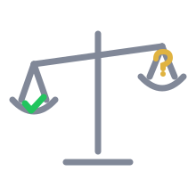

<p align="center">
  
</p>

<h1 align="center">Trial</h1>

<p align="center">
  <em>Don't say done. Prove it.</em>
</p>

<p align="center">
  
  
  
  
</p>

<p align="center">
  <strong>Covering test 6/6 vs 4/6 &middot; verbatim receipts 6/6 vs 0/6 &middot; false claims 0 vs 1 &middot; for +4% tokens</strong><br>
  <sub>Measured on real headless agent sessions (Haiku 4.5, n=6 per arm) fixing a bug whose test suite is green while the bug ships. Correctness and the covering-test metric are scored by a hidden deterministic grader on the tree each agent leaves behind; the verbatim-receipt and false-claim counts are scored by hand from each run's final report (both disclosed in the linked method). Correctness itself saturated (6/6 both arms; the fixture was too easy for this model, reported as such). On a trivial task Trial costs +7% tokens and one extra test run. <a href="benchmarks/results/2026-07-02-false-done-and-cost.md">Full method, aggregate numbers, and limitations</a> &middot; <a href="benchmarks/">rerun the harness</a>.</sub>
</p>

---

Your agent says **"Done. All tests pass."** The suite is green. The bug is still there — because nothing in the suite ever exercised the thing it claims to have fixed. Green because blind, not because right.

Trial is one rule dropped into your agent's rules file: **no "done" until every claim is bound to a receipt** — the exact command it ran, the exit status, and the decisive output, quoted in the report — and the receipt must actually *cover* the claim. It works with whatever model you already run. No config, no server, no separate judge model.

## Real before / after

Same model, same repo, same bug report — "expired sessions must redirect to /login" — minutes apart. These are verbatim excerpts from the [benchmark runs](benchmarks/results/2026-07-02-false-done-and-cost.md), not mockups.

**Without Trial** (run `base-1`):

> All 4 existing tests pass, including the validation that:
> - Sessions without an `expiresAt` field are redirected

No test for expired sessions was added — and that first bullet is **false**: no existing test validates any such thing. A sibling run shipped the *opposite* policy for the same edge case, also "verified". ([The full autopsy →](examples/))

**With Trial** (run `trial-1`):

> ```
> Command: npm test
> Exit status: 0 (success)
>   - ok 5: expired session redirects to login ✓ (NEW TEST)
> All 5 tests pass. 0 failures.
> ```
> The acceptance criterion is met: an expired session now triggers a redirect to /login **at the middleware boundary.**

## The one rule

> **No "done" without a receipt. No receipt without coverage. No escalation unless it's cheaper than the failure it prevents.**

1. **Frame** — restate the request as acceptance criteria at the boundary where the user feels it ("an expired session gets redirected", not "the helper returns true").
2. **Build** — do the work; grep for every copy or caller of the logic you touch.
3. **Prove** — for each criterion, run the command that would *fail if the claim were false*. No such test? Write it, watch it fail on the old behavior, then fix.
4. **Scale scrutiny to risk** — trivial: change, proving check, receipt, out. High-stakes (auth, payments, migrations, deleted data, edited tests, second failure): a fresh-eyes judgment before shipping — a spawned subagent where the platform has them, a separate adversarial self-review pass where it doesn't.
5. **Deliver** — map each criterion to its receipt. A red test you can explain beats a green claim you can't.

The full rule your agent reads is ~2 KB: [`agents/codex/AGENTS.md`](agents/codex/AGENTS.md). The spec behind it: [`SKILL.md`](SKILL.md). Every per-agent copy is byte-synced to that one body and CI fails if any drifts.

## Install

**Claude Code** (as a plugin):

```
/plugin marketplace add Da7-Tech/trial
/plugin install trial@trial
```

**Any agent, one command** (copies/appends the rule into the current project — never a silent overwrite):

```
npx github:Da7-Tech/trial cursor
```

Or copy the file yourself:

| Agent | Copy this | To |
|---|---|---|
| Claude Code | `agents/claude/SKILL.md` | `.claude/skills/trial/SKILL.md` |
| Cursor | `agents/cursor/.cursor/rules/trial.mdc` | `.cursor/rules/` |
| Codex / OpenCode | `agents/codex/AGENTS.md` | `AGENTS.md` (or merge) |
| Windsurf | `agents/windsurf/.windsurf/rules/trial.md` | `.windsurf/rules/` |
| Cline | `agents/cline/.clinerules/trial.md` | `.clinerules/` |
| GitHub Copilot | `agents/copilot/.github/copilot-instructions.md` | `.github/` (or merge) |
| Kiro | `agents/kiro/.kiro/steering/trial.md` | `.kiro/steering/` |
| Roo Code | `agents/roo/.roo/rules/trial.md` | `.roo/rules/` |
| Zed | `agents/zed/.rules` | `.rules` (or merge) |
| aider | `agents/aider/CONVENTIONS.md` | `CONVENTIONS.md` (or merge) |
| Gemini CLI | `agents/gemini/GEMINI.md` | `GEMINI.md` (or merge) |
| Anything else | paste [`agents/codex/AGENTS.md`](agents/codex/AGENTS.md) into whatever rules file your agent reads | |

## FAQ

**Is a receipt actual proof?**
No, and Trial's own spec says so. A receipt is self-reported — a model determined to lie can fabricate one. What it changes is the shape of failure: an agent can drift into an unfounded "done" ambiguously, but it can't quote a command and output it never ran without lying *outright*, and a receipt is something you can re-run. Earlier versions required a hash of the output instead; that was worse — test output has timestamps, so the hash was never reproducible, and a self-reported hash proves nothing a quoted line doesn't. We removed it and [wrote down why](CHANGELOG.md).

**Won't this slow down small edits?**
Measured: +7% tokens on a trivial task, no scope creep, no spawned judges — the overhead is your test suite running once as the receipt (which roughly doubles wall time on a seconds-long task; that's the honest number). The rule's triage clause exists exactly for this: fast path by default, judges only when the stakes justify them.

**Does it make the agent smarter?**
No. In our runs every agent found the bug with or without Trial; the fixture saturated on correctness. What changed is whether the fix arrives with a covering test and a report you can trust — 6/6 vs 4/6 and 6/6 vs 0/6 respectively — and whether the report contains false verification claims (0 vs 1). If someone shows you Trial "doubling fix rates", ask for their grader.

**Judges from the same model share its blind spots, don't they?**
Yes. Fresh context removes momentum and sunk-cost bias — the failure modes behind most rubber-stamping — but it's not a second opinion from a different mind. If you have a second model available, high-stakes judging is a good place to spend it.

## Benchmarks

The harness ships in this repo: a trap fixture whose visible suite is green while the bug ships, a deterministic hidden grader, the verbatim prompts, and [rules for adding results](benchmarks/README.md) — including: losing metrics get published, saturated metrics get reported as saturated, and the rule text under test must be byte-identical to what ships. PRs with new fixtures, models, or harnesses are the most valuable thing you can contribute.

## License

MIT — see [LICENSE](LICENSE).
